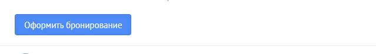
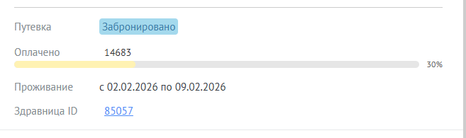
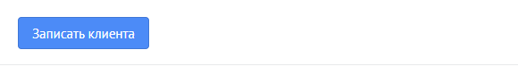
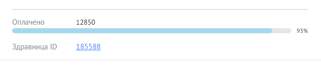

# Amo widget rdesk

Создан через шаблонный репозиторий [Boilerplate-amoCRM-Widget](https://github.com/jasper7466/Boilerplate-amoCRM-Widget).

Проблемы шаблонного репозитория:
- Не реализован режим prod (Пришлось реализовать через webpack)
- Кастомная реализация hot-reload (Из-за этого пришлось сделать пару костылей)


---
## Как пользоваться

<details>
    <summary>Развёртывание</summary>

- Склонировать репозиторий:

        git clone https://github.com/dyuzha/amo-widget.git

- Установить зависимости:

        npm install

</details>

<details>
    <summary>Режим разработки</summary>

Нужное состояние файла `src/api/index.ts`
Расширения должны быть `.js`!
```ts
import { IWidgetExtended } from '../interfaces/widget-extended.interface.js';
import { getCrmContextMessageHandler } from './inbox-post-messages-handlers/get-crm-context.message-handler.js';
import { httpProxyMessageHandler } from './inbox-post-messages-handlers/http-proxy.message-handler.js';
```

- Выполнить сборку виджета-загрузчика:

        npm run build-loader

По завершении работы скрипта в директории `./dist` будет сформирован архив `widget.zip`.

Виджет загрузчик отличается от обычного лишь модифицированным файлом `script.js`, содержимое которого заменяется на конструкцию вида:

```javascript
define([
  'http://localhost:${config.port}/script.js',
  'jquery',
  'lib/components.base/modal',
], function (widget, $, Modal) {
  return widget;
});
```

Это позволяет выполнять загрузку исходного кода с локального сервера без необходимости подготовки zip-архива и его загрузки через веб-интерфейс после каждого изменения.

- Загрузить виджет-загрузчик как приватную интеграцию через интерфейс amo-маркета
- Запустить сборку и локальный хостинг проекта командой:

        npm run start


При этом проект будет автоматически пересобираться при детектировании изменений в \*.ts-файлах и файлах статики ( \*.css, \*.twig).

Для применения изменений после очередной пересборки - достаточно лишь обновить вкладку amoCRM в браузере.

</details>

<details>
    <summary>Режим продакшена</summary>

Нужное состояние файла `src/api/index.ts`
Расширения должны отсутсвовать!
```ts
import { IWidgetExtended } from '../interfaces/widget-extended.interface';
import { getCrmContextMessageHandler } from './inbox-post-messages-handlers/get-crm-context.message-handler';
import { httpProxyMessageHandler } from './inbox-post-messages-handlers/http-proxy.message-handler';
```

- Выполнить сборку для продакшена через webpack:

        npm run build-prod

По завершении работы скрипта в директории `./dist` будет сформирован архив `widget.zip`.

</details>


## Принцип работы
---
Генерирует кнопку в карточке сделки для воронок "Бронирование" и "Мед. центр".

При заполнении данных о статусе, для воронки бронирования, происходит изменение кнопки (превращается в сводную информацию) при подключении [amo-widget](https://github.com/dyuzha/amo-widget).



При заполнении данных о дате формирования договра, для воронки медцентра, происходит изменение кнопки (превращается в сводную информацию) при подключении [amo-widget](https://github.com/dyuzha/amo-widget).



При нажатии на кнопку или на ID здравницы из сводной информации, открывается существующая заявка в Здравнице или генерируетс новая. Данная карточка содержит все поля из AmoCRM, которые поддерживает API.

